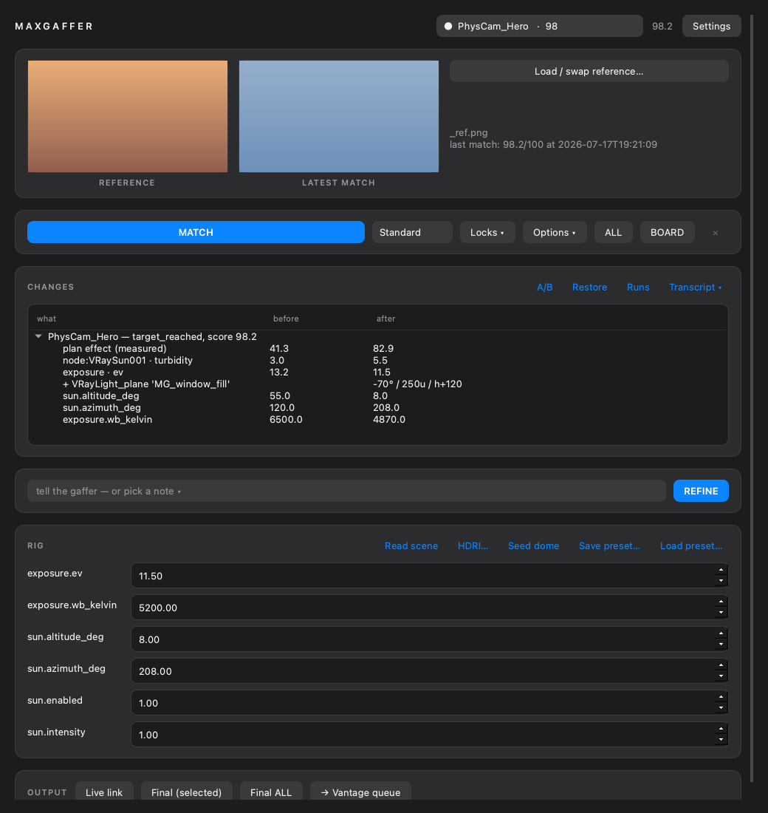

# MaxGaffer

> Spec: **[SPEC.md](SPEC.md)** (v2, post stress-test — locked decisions, guards, reliability
> model) · Forward plan: **[tasks/plan.md](tasks/plan.md)** (P0 on-box bring-up → v1.0).

**The gaffer to MaxDirector's director.** Pick a camera from the shot board, hand it a
lighting reference image, press **MATCH LIGHTING** — and MaxGaffer analyzes the reference,
first-guesses a rig from gaffer craft tables, then iterates the scene's **sun, HDRI dome,
exposure, white balance and practical-light groups** until the render's light matches the
reference — while the **Chaos Vantage live link mirrors every step in real time**. Each
camera keeps its own matched lighting state, so "render every shot under its own light" is
one button (V-Ray finals in Max — stock Vantage 3.x has no headless CLI — plus one-click
per-camera vrscene exports for Vantage's in-app Batch Render queue).

Target: **3ds Max 2026 (Py 3.11, PySide6) + V-Ray 7 + Chaos Vantage 3.x.** Internal Sthyra
pipeline tool, sibling of MaxDirector (same Omega gateway, same hexagon architecture, same
key — borrowed automatically if MaxDirector is installed).



*The dock (offscreen-rendered by `scripts/ui_preview.py` — regenerate after any UI change;
the [scenario board](docs/ui/board.png), [change report](docs/ui/report.png),
[plan preview](docs/ui/plan.png) and [settings](docs/ui/settings.png) render the same way).*

## Who does what (the split of powers)

| Job | Owner | Why |
|---|---|---|
| Exposure (EV) + white balance | **histogram solver** (deterministic; WB reads the HIGHLIGHT quartile — the illuminant, not the furniture) | measurable — never let an LLM eyeball photometry |
| Reference semantics | **3-sample ANALYZE consensus** (majority/median/circular-mean) | a single sample coin-flips; three don't |
| Sun azimuth (coarse) | **sweep grid + LLM multiple-choice, cross-checked by the direction metric** | two independent judges on the weakest call |
| Sun geometry refine, sky character, HDRI rotation, light-group balance, mood | **Opus 4.8 vision** via Omega, ≤4 bounded changes/iteration | semantic judgment, hard-railed by the genome |
| Accept / revert / stop | **tonal critic** (deterministic 0-100) | keep-best + slump-revert make exploration safe |
| Taste, final say | **you** | locks, live sliders, undo — one undo record per apply |

Every LLM proposal is validated against the **genome** (`core/genome.py`): unknown params
dropped, locked params refused, bounds clamped, per-iteration step limits enforced. The
critic compares only what transfers between *different* scenes — tonal envelope, color
mood, and (since v0.6) a mean-centered 3×3 luminance grid: WHERE the light lives — never
SSIM. The loop shows the model its own parameter trajectory to damp oscillation, and every
executed plan is probe-rendered before/after with the critic's verdict in the popup.
Measured on the live hidden-target benchmark: Phase B 14.3 → **98.25 (4° sun-direction
error)** vs the pre-v0.6 baseline of 85.1 best / 56.6 stalled (dated 2026-07-16 run).

## Architecture (hexagon, enforced)

```
maxgaffer/core/       PURE python, ZERO pymxs/Qt (test-enforced) — genome, solver, critic,
                      director loop, rules, session, prompts, Omega client, stdlib PNG stats
maxgaffer/maxbridge/  the ONLY pymxs importer — scene/rig introspection, apply, exposure
                      hosts, loop renders, Vantage (live link + vrscene + vantage_console)
maxgaffer/ui/         PySide6 dock (camera board · reference · match loop · rig sliders · Vantage)
maxgaffer/sidecar/    optional Pillow stats CLI for a system python
tests/                pytest — runs on any OS, no Max needed
```

Dependency floor is **stdlib-only**: the Omega client is urllib, loop-render stats decode
through a built-in PNG reader. Pillow (optional, installer tries) upgrades JPEG reference
ingestion and slims LLM payloads; without it, references transcode through Max's own bitmap
I/O. There is no torch, no OpenCV, no required pip package.

## Install (on the Max 2026 box)

1. Clone/copy this folder, double-click **`scripts\install.bat`**.
2. Restart Max → Customize → Customize User Interface → category **MaxGaffer** → drag the
   action to a toolbar.
3. Click it. If MaxDirector is installed, the oc_ key is borrowed automatically; otherwise
   Settings → paste key → **Test gateway**.
4. (Recommended) Start the Vantage live link once from the V-Ray menu if the in-plugin
   button reports it couldn't find the action.

`python scripts/preflight.py [oc_key]` — anywhere — prints exactly what's ready; run it in
Max's scripting listener for the pymxs/V-Ray/Vantage/rig checks too.

## Dome seed + scenario board (v0.9)

Two answers to the parametric loop's honest ceiling — the UNREACHABLE reference:

**Seed dome** (RIG row) synthesizes an equirect **HDR panorama from the reference
itself** — its colors become the ambient light from every direction (mirror-folded around
the camera's view, sky/ground extended, structure blurred away), and a high-energy sun
disc is injected at the solved sun position (altitude-matched blackbody tint; overcast
references get a lifted sky and no disc). The pano is written as a real Radiance `.hdr`
(pure-stdlib RGBE writer — no Pillow, no numpy), bound to the dome via the existing
texture path, rotation zeroed (the pano is world-oriented; `dome.rotation_deg` stays a
live genome param). The previous dome texture/rotation is snapshotted once — **Restore**
puts it back. This is the deterministic, local, reproducible version of Chaos's AI Mood
Match (V-Ray 7 U3, SketchUp/Rhino-only) — and for a generative pano, `build_seed`'s
`pano_path` ingests any external equirect (DiffusionLight-class estimators) through the
identical orient/inject pipeline. Seeds are per camera and follow the shot: switching
cameras, batch finals and vrscene exports re-bind each camera's own seed. Honest limit:
the pano is deliberately blurred illumination, so where the dome is VISIBLE in glossy
reflections or through glazing it reads as soft color, not a crisp sky — keep the dome
camera-invisible on shots where that matters.

**BOARD** (action bar) is Light Gen with numbers: up to six candidate rigs — as-analyzed,
golden low, overcast soft, backlit rim, cool north, practicals at dusk — each built by the
SAME craft tables as the first guess, probe-rendered, and **critic-scored against the
reference** when one is bound (reference-less boards render unscored — pick by eye). The
measured winner comes preselected; **ADOPT** applies it and saves it as the camera's
state, so MATCH/REFINE continue from it. The board leaves the scene exactly as it found
it unless you adopt.

## The conversation loop — refine with director's notes (v0.8)

Watch the match live in Vantage (the link mirrors every apply), and when it isn't right,
**tell it**: type a note — *"exposure is too much"*, *"sun should come more from the
left"* — or tap a chip. Three things happen:
1. a **craft table** converts common critiques into instant bounded nudges (too bright →
   +0.7 EV; sun more left → −20° azimuth; "way too" doubles the local nudge) — effect in
   the very next frame, no model in the loop;
2. a **3-lens ensemble** attacks the note from independent angles — exposure-first,
   geometry-first, mood-first agents each propose corrections; every branch is rendered
   and scored; the winner survives;
3. the winner continues into a **deep match** with your note pinned into every prompt as
   the DIRECTOR'S NOTE (it outranks the reference analysis on conflict), notes accumulate
   per camera across the session, and swapping the reference mid-conversation re-analyzes
   automatically.
The UI shows reference vs latest match side by side; the log is the conversation record.

## Deep match — the 99 mode (v0.7)

Tick **deep match → 99** for hero shots. The precise promise, measured live:
* when the reference is **reachable** (same scene / relight / compatible space), the
  engine lands **≥99**: annealed steps and tightening solver deadbands finish what
  exploration started, then an LLM-free **adaptive coordinate line search** (climb while a
  rendered nudge measurably improves the critic, accelerate on streaks, halve on failure,
  EV/WB are axes too so geometry can never fake exposure — and when single axes stall, the
  coupled pairs are probed **diagonally** so a tonal↔geometry compensation ridge can't
  trap the search) squeezes to the optimum.
  Live benchmark, asserted: **99.01 from the basin, deterministic legs only**; full live
  pipeline **18.7 → 99.3** (2026-07-18, post round-3 stress audit).
* when the reference is a **different scene**, no lighting can produce its histogram —
  the engine converges to the scene's own optimum and the report SAYS SO: *"ceiling
  proven — the gap left is content, not lighting."* Two consecutive diminishing-return
  rounds (< 0.2 score) or full step-floor exhaustion is the convergence proof.
Cost: up to ~10 loop iterations + ≤120 polish probes at loop resolution — hero-shot money.

## Agent mode — scene-wide plans (v0.5)

With **scene-wide plan first** checked (default), MATCH runs the full agent flow:
**read** every current setting (all V-Ray renderer properties, environment map, exposure
control, every light with its full property list, cameras — introspected live, nothing
memorized) → **understand + compare** (the model sees the digest AND the reference) →
**plan** an explicit change list — any existing property on any target, plus NEW lights
placed camera-relative (never raw world coordinates), always MG_-prefixed on the MG_lights
layer → **preview** (or auto-execute) → **execute** as ONE undo step with before/after
capture → the iterative match loop refines → a **"scene changed" popup** reports every
value changed (before → after), every light placed, and any warnings.

Grounding rule: the plan may only reference targets and property names that exist in the
digest — full access to everything that exists, zero access to hallucinated names.
Vantage note: Vantage 3.3 exposes no external settings API; it renders what Max streams,
so controlling everything in Max is controlling Vantage's input.

## Using it

1. **Refresh** — the camera board lists every camera (name · ref-dot · last score).
2. Select a camera → **Load reference…** (JPEG/PNG/WEBP). One reference per camera.
3. Lock anything that must not move (padlocks list — e.g. lock `exposure.ev` if the
   client's exposure is contractual).
4. Optional openers: **BOARD** renders the scenario candidates (adopt one to start from
   it), **Seed dome** rebuilds the dome HDRI from the reference (best before a deep match
   on a reference the stock HDRI can't reach).
5. **MATCH LIGHTING**. Watch the log — analysis → first guess → per-iteration score,
   analytic EV/WB, the model's changes with reasons. Watch Vantage — every apply syncs.
   Optional **sun sweep first** grid-solves the sun direction before iterating.
6. Judge it: iteration **thumbnails render inline in the log**, and the **A/B** button flips
   the scene between pre-match (A) and matched (B) — Vantage mirrors the flip. **Restore
   pre-match light** exits the experiment entirely.
7. Nudge sliders in **RIG** (live-applied → Vantage mirrors). The state is saved per camera;
   re-selecting a camera re-applies its light (toggle on the board).
8. **Finals**: "Render ALL matched (V-Ray)" renders every camera under its own light at
   final resolution, or "Export vrscenes → open Vantage" hands per-camera scenes to
   Vantage's in-app Batch Render queue.

Iteration renders go to `%LOCALAPPDATA%\MaxGaffer\sessions\<scene>\<camera>\<timestamp>\`
(oldest runs auto-pruned, `keep_runs` in config, default 10). Per-camera bindings persist in
`<scene>.maxgaffer.json` next to the .max file. The sun sweep also refines **altitude** from
its winning candidate's hint, not just azimuth.

## ON-BOX VERIFICATION — one command

```maxscript
python.ExecuteFile @"C:\<repo>\scripts\onbox_spikes.py"
```
On a throwaway scene copy (VRaySun + dome + camera), **`scripts/onbox_spikes.py` measures
the whole checklist below automatically** — property names per candidate tuple, dome enum,
exposure host, and the sign conventions via tiny probe renders (WB warm direction, EV
darkening, sun-swing response, sun-off-vs-VRaySky) — snapshots and restores the scene, and
writes `%LOCALAPPDATA%\MaxGaffer\spike_report.txt`. Zero FAILs = Checkpoint 0, go match.
Manual leftovers: #9 only if the live-link probe reports MANUAL (click the V-Ray menu once
and note the label), #14 (watch VRAM with the link up on a heavy scene).

**Already verified LIVE off-box (2026-07-16):** the entire LLM leg — gateway auth + wire
(`scripts/live_gateway_smoke.py`, 4/4 PASS: ping/ANALYZE/DELTAS/SWEEP against real
opus-4.8, correct sweep pick) — and the deterministic engine end-to-end
(`scripts/sim_match.py` Phase A: score 11→98.8 on a hidden-target world, EV landed exactly,
WB walked monotonically to target; Phase B full live pipeline reported 85.1 best run).
Live fire also caught and fixed two real defects: Cloudflare rejecting UA-less urllib
(client now sends a User-Agent) and the LLM overriding solver-owned exposure (now
structurally refused, not just prompted).

**Verified against the official docs (2026-07-16) — V-Ray 7 · Vantage 3.3 · Max 2026:**

| Fact | Consequence in MaxGaffer |
|---|---|
| VRaySun props are `.enabled .turbidity .ozone .intensity_multiplier .size_multiplier .sky_model` | candidate tuples confirmed, checklist #1 pre-cleared |
| VRayLight `.on` + `.type` (0 Plane · **1 Dome** · 2 Sphere · 3 Mesh) `.multiplier` | dome detection confirmed, #2 pre-cleared |
| Max Physical Camera: `exposure_gain_type` (1=Target) + **`exposure_value` = direct EV**; `f_number`; `shutter_length_seconds` (a DURATION — legacy VRayPhysical's `shutter_speed` is a 1/s SPEED); `white_balance_type` (1=Temperature) + `white_balance_kelvin` | EV now written directly via Target mode (no ISO math on native cams); shutter units handled per-property; WB enum confirmed |
| V-Ray exposure control created via `vrayCreateVRayExposureControl()`; needs "Use 3ds Max photometric scale" | auto-created when a scene has no exposure host (`auto_exposure_control`) |
| **Vantage 2.0+ removed stock command-line rendering** (Chaos support-confirmed; Developer Edition only) | finals default to the **V-Ray backend in Max**; per-camera vrscene export + "open Vantage" feeds the in-app Batch Render queue; CLI path kept behind `final_render_backend:"vantage_cli"` |
| Live link = V-Ray toolbar action "Initiate a Live-Link to Chaos Vantage", port 20701, starts Vantage itself, **same action toggles off** | actionMan scan targets that label; UI button labeled as a toggle |
| VRaySky auto-binds to "the first **enabled** VRaySun" | `overcast_sun_mode` defaults to **"dim"** (sun kept alive at 0.05×) |
| Max 2026 = Python **3.11.9** + PySide6 | install.bat's `Python311` user-site path confirmed |
| `vrayExportVRScene "file" startFrame:N endFrame:N` (exports read **V-Ray GPU** render settings; geometry/lights/cameras export regardless) | export call confirmed; harmless for our use — Vantage ignores renderer settings |

### The checklist the runner automates

| # | What | How to verify | Where to fix |
|---|---|---|---|
| 1 | VRaySun props: `intensity_multiplier`, `size_multiplier`, `turbidity` | `showProperties (getNodeByName "VRaySun001")` | `scene.SUN_*` |
| 2 | VRayLight dome `.type == 1` | make a dome, `(getNodeByName "VRayLight001").type` | `scene._dome_type_value` |
| 3 | Dome HDRI rotation prop (`horizontalRotation` on the VRayBitmap texmap) — else node-Z fallback engages | `showProperties dome.texmap` · then move the RIG dome.rotation slider and confirm the HDRI spins in Vantage | `scene.DOME_TEX_ROT` |
| 4 | Exposure host: V-Ray exposure control `.ev` + WB `temperature`/mode enum | Environment panel → Exposure Control → V-Ray; `showProperties SceneExposureControl.exposureControl` | `exposure.EC_*`, `_nudge_wb_mode_*` |
| 5 | Physical camera ISO/f/shutter prop names (only if you use per-camera exposure) | `showProperties (getNodeByName "PhysCamera001")` | `exposure.CAM_*` |
| 6 | **WB kelvin direction**: raise `exposure.wb_kelvin` slider by +2000 → render must get **warmer** | RIG slider + one loop render | if inverted: report — solver sign flips in `core/solver.solve_wb` |
| 7 | `vrayExportVRScene()` exists + kwargs (`exportCompressed`, `startFrame`) | listener: `vrayExportVRScene "C:\\tmp\\t.vrscene"` | `vantage.export_vrscene` |
| 8 | `vantage_console.exe` path + CLI flags (`-scenefile -outputFile -outputWidth -outputHeight -frames`) | run the command from `vantage.vantage_command` by hand once | `config.vantage_console`, `vantage.vantage_command` |
| 9 | Live-link autostart (maxscript global or actionMan scan) | click **Start live link**; if "no entry point found", start it via the V-Ray menu once and tell me the menu label — I'll pin the action | `vantage.LIVE_LINK_GLOBALS`, `_find_live_link_action` |
| 10 | Loop render writes PNG with VFB off, respects size, restores render setup | select camera → MATCH with 1 iteration → check the run folder | `render.render_frame` |
| 11 | Sun move on a Daylight-assembly sun (controller-locked transforms warn in rig notes) | try a scene with a Daylight system | `scene.classify_rig` note / detach sun |
| 12 | Sidecar (optional): point Settings → system python at any Pillow-equipped python | `python -m maxgaffer.sidecar.metrics_cli some.jpg` prints stats JSON | `config.system_python` |
| 13 | Sun-off looks: disabling VRaySun must not black out a VRaySky-driven environment | rules set `sun.enabled 0` for overcast refs — toggle it manually once; if the sky dies, set `overcast_sun_mode: "dim"` in config (keeps sun on at 0.05 intensity) | `config.overcast_sun_mode` |
| 14 | GPU contention: Vantage live link + V-Ray GPU loop renders on one card | run a match with the link up on a heavy scene; if VRAM-starved, set V-Ray to CPU for matching or close the link during MATCH | workflow note, no code |
| 15 | Draft-sampler property names (opt-in checkbox) | tick "draft sampler", run a 1-iteration match: log shows which props changed + restored; `showProperties renderers.current` if none matched | `draft.DRAFT_PROPS` |
| 16 | Dome HDRI file property + photometric light intensity prop | RIG → HDRI… on a dome; dim a photometric group slider | `scene.DOME_TEX_FILE`, `scene.LIGHT_MULT` |
| 17 | Dome seed end-to-end: build .hdr from the reference, bind, render, restore | automated (spike Q) | `core.domeseed`, `scene.set_dome_texture` |
| 18 | Seeded pano u-origin: the sun disc lands where the solved azimuth says | visual — compare disc position vs `sun.azimuth_deg` in Vantage | `domeseed.build_seed` yaw math |
| 19 | Color management: OCIO/ACES display transform vs saved loop PNGs | automated detection (spike S); if Mode ≠ gamma, eyeball one probe vs the VFB | `docs/STRESS.md` §1 |

## Modes (config.json / Settings)

* **`software_exposure`** — V-Ray GPU applies camera/exposure-control EV only at the
  VFB display stage, so saved loop renders don't reflect the EV/WB the solver sets
  (measured on-box: 5 stops of EV moved the saved key < 2e-5). With this on, MaxGaffer
  applies EV/WB to every loop/board/probe/final frame in software (anchored at the
  camera's pre-match snapshot), making the analytic solver renderer-independent. A
  runtime 2-probe check at match start **auto-enables it** when the host is measured
  inert, so the flag mostly documents itself.
* **`no_renders`** — apply-only mode: MATCH = analyze → first guess → ONE undoable
  apply → read-back verification → change report. Loop, sweep, board probes, plan
  measurement and finals are all off. For live-link-driven workflows (Vantage mirrors
  every apply) and boxes where renders are unavailable.

## Known failure modes (stress-tested, round 2)

* **Albedo trap** — the reference and your scene are *different rooms*: matching a white
  Scandinavian reference inside a dark-walnut scene biases the exposure/WB solver (it can
  only see histograms, not albedo). Round-2 defenses: the key is **center-weighted** (60/40),
  the solver runs on a **leash** (±4 EV / ±3000 K total per run), and hitting the leash twice
  prints an explicit diagnosis telling you to lock `exposure.ev` and set it by eye. That is
  the honest limit of statistics across different scenes.
* **Contaminated iterations** — when the solver had to move EV ≥ 1.5 stops, the render the
  model just critiqued was badly mis-exposed, so its intensity/group proposals are dropped
  for that iteration (geometry proposals survive). Logged when it happens.
* **Loop cost is render cost** — iteration renders use your current V-Ray sampler at
  `loop_width` (480 px default). On a heavy interior that's minutes per iteration ×
  (8 sweep + N iterations). MaxGaffer deliberately never touches sampler settings (contract:
  render setups are the artist's); use a draft preset for matching sessions if needed.
* **Matches are explorations** — the pre-match light is snapshotted automatically per camera;
  **Restore pre-match light** puts it back exactly. Baselines for practical groups are
  adopted once (by light name, persisted) and never re-captured, so MaxGaffer dimming a
  group to 0 can never poison its authored value.

Known limits (deliberate): one sun + one dome (extras are ignored with a note), no
volumetrics/aerial-perspective matching, no per-light solo — groups are layer-based dimmer
boards. Since v0.3: photometric/standard lights join the groups, EXR/HDR/TIFF references
ingest via Max's own bitmap I/O, overcast can dim instead of disable the sun
(`overcast_sun_mode`), and **Match ALL (refs)** queues every referenced camera unattended.

## API (MaxDirector integration / any pipeline tool)

```python
from maxgaffer.api import match_camera, match_all_cameras, render_cameras
result = match_camera("PhysCam_Hero", r"D:/refs/dusk.jpg", log=print)   # → score/state/renders
match_all_cameras(log=print)                                            # overnight queue
render_cameras(["PhysCam_Hero"], r"D:/out", print)     # finals (V-Ray backend by default)
```
Main-thread only (drives pymxs); state persists in the same session sidecar the dock uses,
so UI and API are interchangeable mid-project. This module IS the "LightMatch engine"
MaxDirector's SPEC deferred to its P2.

## Dev (off-Max, any OS)

```bash
python3 -m venv .venv && .venv/bin/pip install pytest pillow
.venv/bin/python -m pytest tests/ -q          # full pure-core suite (see SPEC for count)
```

The suite catches the classics: EV/WB sign conventions, the 180°-wrap ambiguity, LLM junk
replies, slump-revert, lock enforcement, stdlib-vs-Pillow stats agreement — plus the round-2
stress regressions (baseline poisoning, analytic leash, contamination guard, center-weighted
key, pre-match persistence).
